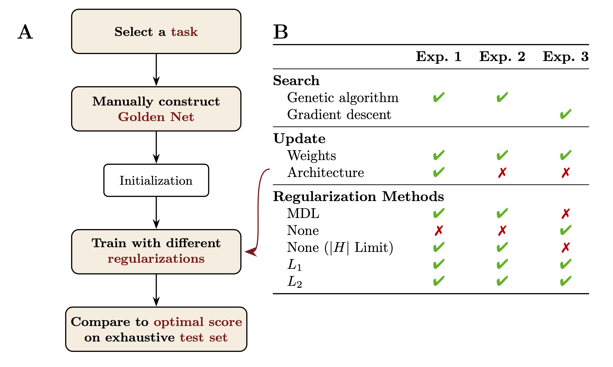

<h1 align="center">A Minimum Description Length Approach to Regularization in Neural Networks</h1>

<h3 align="center">
    Matan Abudy, 
    Orr Well,
    Emmanuel Chemla,
    Roni Katzir,
    Nur Lan
</h3>

<p align="center">
    
    
    <a href="https://arxiv.org/abs/2505.13398"></a>
</p>

<p align="center">
    
</p>

This repository contains the code accompanying the paper _A Minimum Description Length Approach to Regularization in
Neural Networks_. It builds on the [Minimum Description Length RNN](https://github.com/taucompling/mdlrnn) repository
and its PyTorch port [MDLRNN-torch](https://github.com/0xnurl/mdlrnn-torch). We extend the original codebase to support
additional regularization schemes, golden networks, gradient descent training of MDL-RNNs, and include various
improvements and bug fixes.

## Getting started

1. Install Python 3.9
2. Install system dependencies

**macOS:**

```shell
brew install freetype mpich
```

**Ubuntu:**

```shell
apt-get install libsm6 libxext6 libxrender1 libffi-dev libopenmpi-dev libssl-dev libnss3-dev libncurses5-dev
```

3. Install Python packages:

```shell
pip install -r requirements.txt
```

4. Running a simulation:

```shell
python main.py --simulation <simulation_name> -n <number_of_islands>
```

Simulations are defined in `simulations.py`. Intermediate and final networks are saved in the `networks/` directory as
`.pkl` and `.dot` files.

## Reproducing Results

All experiments from the paper are reproducible using this repository. Grammars are in `corpora.py`, golden networks in
`manual_nets.py`, and experiments in `simulations.py`. The experiments were run in a SLURM server using MPI for
parallelism. To run locally, set `migration_channel="file"`.

### Experiment 1: Genetic Architecture Search

The tasks are defined in `simulations.py` as:

- `an_bn`
- `an_bn_cn`
- `dyck_1`
- `dyck_2`
- `arithmetic`
- `toy_english`

To control the regularization method, you can override the configuration. By default, the simulation runs with the MDL
regularizer, defined by `grammar_multiplier=1` and `data_given_grammar_multiplier=1`, while
`regularization_method=None`.

To use L2 regularization, for example, set `grammar_multiplier=0` and `regularization_method="l2"`.

The configuration can be overridden via the command line using `--config`, where you can also specify `max_grammar_size`
to limit $|H|$, and which golden network to include.

An example of running locally (without MPI) a Dyck-2 simulation with $L_2$ is as follows:

```shell
python main.py -s dyck_2 -n 250 --config "{\"golden_networks\": [\"dyck_2\"], \"grammar_multiplier\": 0, \"regularization_method\": \"l2\", \"no_improvement_time\": 0, \"migration_channel\": \"file\"}"
```

To recreate the entire experiment, make sure to run all four regularizers with all tasks using the appropriate config
command-line options.

### Experiment 2: GA in weight-training settings

Again, the tasks are defined in `simulations.py` as:

- `an_bn_train_weights_from_golden`
- `an_bn_cn_train_weights_from_golden`
- `dyck_1_train_weights_from_golden`
- `dyck_2_train_weights_from_golden`
- `arithmetic_train_weights_from_golden`
- `toy_english_train_weights_from_golden`

Where the simulations defines in it that population is initialized only with golden networks and no architecture
mutations is allowed (via the configs `num_golden_copies_in_initialization=500` and
`allow_architecture_changing_mutations=False` respectively).

### Experiment 3: Gradient Descent

To train our differentiable golden networks, you can use the `train_mdlrnn_backprop.py` script, which trains the entire
tasks found in the paper.

## Analyzing Results

To analyze results from GA simulations, maintain a CSV file that logs each simulation along with its ID, status (e.g.,
Running, Finished, Time Limit), and objective.

CSV should look something like this:

```csv
task,server,current_job_id,state,objective,simulation_id
an_bn,ServerA,1,Finished,MDL,an_bn_prior_0.3_batch_500_<simulation_hash>
an_bn,ServerA,2,Finished,|D:G| + L1,an_bn_prior_0.3_batch_500_<simulation_hash>
an_bn,ServerA,3,Finished,|D:G| + L2,an_bn_prior_0.3_batch_500_<simulation_hash>
an_bn,ServerA,4,Finished,|D:G| + Limit |G|,an_bn_prior_0.3_batch_500_<simulation_hash>
...
```

Then, run the following script on the server which holds the results:

```shell
python analysis/generate_simulation_results.py
```

This will generate a results CSV that can be further analyzed locally without needing to access the server again, also
locally
using:

```shell
python analysis/analyze_simulation_results.py
```

For analyzing experiment 3 results, after `train_mdlrnn_backprop.py` is ran, it generates a results CSV for analysis by:

```shell
python analysis/analyze_backprop_results.py
```

Note that the analysis scripts will both generate the target plot figure in the paper as well as the latex tables.

## Citation

```bib
@misc{2025minimumdescriptionlengthapproach,
      title={A Minimum Description Length Approach to Regularization in Neural Networks}, 
      author={Matan Abudy and Orr Well and Emmanuel Chemla and Roni Katzir and Nur Lan},
      year={2025},
      eprint={2505.13398},
      archivePrefix={arXiv},
      primaryClass={cs.LG},
      url={https://arxiv.org/abs/2505.13398}, 
}
